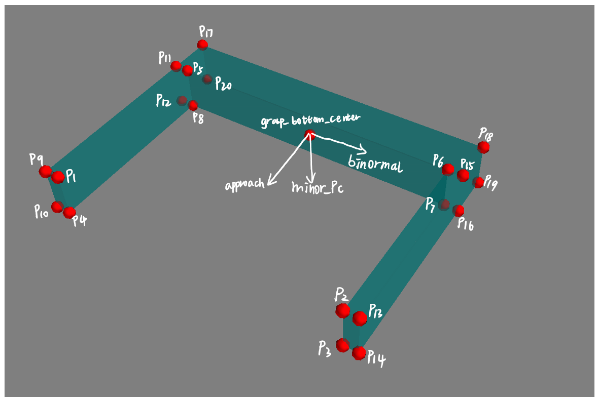

# PointNetGPD: Detecting Grasp Configurations from Point Sets
PointNetGPD (ICRA 2019, [arXiv](https://arxiv.org/abs/1809.06267)) is an end-to-end grasp evaluation model to address the challenging problem of localizing robot grasp configurations directly from the point cloud.

简单介绍一下PointNet的代码流程：  
1. 离线阶段
   1.  **候选抓取采样与打分：** 针对[YCB objects Dataset](http://ycb-benchmarks.s3-website-us-east-1.amazonaws.com/) 中的CAD模型，利用传统采样方法（默认Antipods采样）对进行候选抓取姿态（夹爪6D姿态）采样，并通过Force Closure结合 GWS 方法对所检测出的姿态进行打分，生成候选抓取数据集存起来备用；
   2.  **点云原始数据生成：** [YCB objects Dataset](http://ycb-benchmarks.s3-website-us-east-1.amazonaws.com/) 提供了一些物体的CAD模型，以及某些视角下这些物体的激光深度图；但是我们在训练网络时候，使用的是点云数据，因此，这里提前要把某些视角下的深度图转换为点云数据，以备后续使用；
   3.  **PointNet模型训练：** 利用生成的某候选夹爪姿态（步骤1.i），结合CAD模型的多视角点云（步骤1.ii），提取出来该候选抓取姿态下夹爪闭合区域内的点云；将夹爪闭合区域内的点云以及该抓取姿态的分数送入PointNet中进行训练；
2. 在线阶段  
   1. **抓取采样：** [从点云中直接采样候选抓取姿态](https://www.researchgate.net/publication/318107041_Grasp_Pose_Detection_in_Point_Clouds) ，并剔除掉与桌面碰撞、与场景点云碰撞的非法抓取；
   2. **打分：** 提取剩余的抓取姿态夹爪内部的点，进一步剔除掉不合理的数据之后，将点集送入训练好的PointNet网络中打分；
   3. **排序：** 将候选的抓取按照分数从高到低排序，输出分数最高的抓取。


## Video
- 作者的实验视频  
[](https://www.youtube.com/watch?v=RBFFCLiWhRw)
- 本人的复现实验视频  
[](https://www.youtube.com/watch?v=OfvJ-HpKjI4&t=63s&ab_channel=Hymwgk)  
在实验中发现，成功率并不高，不过个人感觉应该是受到了手眼标定的精度以及panda夹爪构型的影响（panda夹爪的深度比较浅，最大张开距离也比较小）
## Before Install
在使用前，clone的代码文件夹需要放在如下的code文件夹中:
```
mkdir -p $HOME/code/
cd $HOME/code/
```
## Install all the requirements (Using a virtual environment is recommended)
1. Make sure in your Python environment do not have same package named ```meshpy``` or ```dexnet```.

2. Clone this repository:
    ```bash
    cd $HOME/code
    git clone https://github.com/lianghongzhuo/PointNetGPD.git
    ```

3. Install our requirements in `requirements.txt`
    ```bash
    cd $HOME/code/PointNetGPD
    pip install -r requirements.txt
    ```
4. Install our modified meshpy (Modify from [Berkeley Automation Lab: meshpy](https://github.com/BerkeleyAutomation/meshpy))
    ```bash
    cd $HOME/code/PointNetGPD/meshpy
    python setup.py develop
    ```

5. Install our modified dex-net (Modify from [Berkeley Automation Lab: dex-net](https://github.com/BerkeleyAutomation/dex-net))
    ```bash
    cd $HOME/code/PointNetGPD/dex-net
    python setup.py develop
    ```
6. 这里需要根据自己的夹爪来修改如下的夹爪文件；  
    你可以模仿着新建一个文件夹，也可以直接在这个文件中修改，之后离线与在线节点的夹爪姿态检测都会根据夹爪具体的尺寸来生成。
    ```bash
    vim $HOME/code/PointNetGPD/dex-net/data/grippers/robotiq_85/params.json
    ```
    离线阶段用到的参数，（默认）通过antipod采样法对CAD模型数据集中的模型进行抓取姿态的采样时候用到的参数，在作者的代码中，这部分的参数一共有两点作用：  
    >- 离线生成抓取姿态数据集时，用此参数结合antipod采样法对CAD模型数据集中的模型进行抓取姿态的采样；
    >- 离线训练PointNet时，在dataloader中，使用该参数对提取夹爪内部的部分点云，进而将该部分点云送入网络进行训练；  
  
    **但是**个人在看代码的过程中，发现第二点的作用是不合适的：
    >对PointNet训练和使用时，应该保证离线训练时的点云采样方式尽可能和在线点云采样方式相同，使用的夹爪参数也应该尽可能一致，这样网络输出的结果将会更好；  
    如果希望提取某姿态下夹爪内部点云，就需要根据给定的夹爪尺寸对夹爪建立尺寸数学模型；  
    而原始代码中，离线提取夹爪内部点云使用的夹爪数学模型和在线提取点云时使用的夹爪数学模型是不同的，分别使用了两种构建形式，并且在线和离线的夹爪参数不太一致，本修改代码中，仅在抓取姿态数据集生成阶段使用了离线参数；  
    将在线夹爪内部提取时的夹爪数学模型替换为和离线训练PointNet时dataloader中相同的数学模型。


    ```bash
    "min_width":      夹爪的最小闭合角度
    "force_limit":      抓取力度限制
    "max_width":     夹爪最大张开距离
    "finger_radius": 用于软体手，指定软体手的弯曲角度（弧度制），一般用不到，补上去就行了
    "max_depth":     夹爪的最大深度，竖向的距离
    ```
    以下是在线检测部分所需要的参数:
    ```bash
    "finger_width":    夹持器的两个夹爪的“厚度”
    "real_finger_width":   也是两个夹爪的厚度，和上面写一样就行（仅仅用于显示，影响不大，不用于姿态检测）
    "hand_height":   夹爪的另一侧厚度，一会儿看图
    "hand_height_two_finger_side":   没有用到，代码中没有找到调用，所以不用管
    "hand_outer_diameter":  夹爪最大的可以张开的距离，从最外侧量（包括两个爪子的厚度）
    "hand_depth":   夹爪的竖向深度
    "real_hand_depth":   和hand_depth保持一致，代码中两者是相同的
    "init_bite":  这个是用于在线抓取检测时，定义的一个后撤距离，主要是避免由于点云误差之类的，导致夹爪和物体碰撞，以米为单位，一般设置1cm就行了
    ```
    ```params.json```参数的具体定义示意图，修改后的本代码，离线的夹爪参数仅作为候选抓取姿态的采样，而不涉及到夹爪内部点云的提取。

    

      

## Genearted Grasp Dataset Download
You can download the dataset from: https://tams.informatik.uni-hamburg.de/research/datasets/PointNetGPD_grasps_dataset.zip  
这里给出的数据集是根据roboticq85夹爪离线生成的候选抓取姿态，而不是点云。

## Generate Your Own Grasp Dataset

1. Download YCB object set from [YCB Dataset](http://ycb-benchmarks.s3-website-us-east-1.amazonaws.com/). 
2. 原代码中，将YCB的数据集放在了如下位置:
    ```bash
    mkdir -p $HOME/dataset/ycb_meshes_google/objects
    ```  
    如果你的Home盘分区不够大，希望换一个位置，可以:  
    >```bash
    >cd $HOME/code/PointNetGPD/dex-net/apps  
    >vim generate-dataset-canny.py
    >```  
    >修改YCB dataset 路径
    >```python
    >219  #存放CAD模型的文件夹
    >220  file_dir = home_dir + "/dataset/ycb_meshes_google/objects"   #获取模型的路径  
    >```
    >也可以修改计算结果文件的存放位置
    >```python
    >61  #将gpg得到的候选抓取文件存放起来
    >62  good_grasp_file_name = "/home/wgk/win10/generated_grasps/{}_{}_{}".format(filename_prefix, str(object_name), str(len(good_grasp)))
    >```

    每个物体的文件夹结构都应该如下所示:
    ```bash
    ├002_master_chef_can
    |└── google_512k
    |    ├── kinbody.xml (no use)
    |    ├── nontextured.obj
    |    ├── nontextured.ply
    |    ├── nontextured.sdf (generated by SDFGen)
    |    ├── nontextured.stl
    |    ├── textured.dae (no use)
    |    ├── textured.mtl (no use)
    |    ├── textured.obj (no use)
    |    ├── textured.sdf (no use)
    |    └── texture_map.png (no use)
    ├003_cracker_box
    └004_sugar_box
    ...


    ```
3. Install SDFGen from [GitHub](https://github.com/jeffmahler/SDFGen.git):
    ```bash
    git clone https://github.com/jeffmahler/SDFGen.git
    cd SDFGen
    sudo sh install.sh
    ```
4. Install python pcl library [python-pcl](https://github.com/strawlab/python-pcl):
    ```bash
    git clone https://github.com/strawlab/python-pcl.git
    pip install --upgrade pip
    pip install cython
    pip install numpy
    cd python-pcl
    python setup.py build_ext -i
    python setup.py develop
    ```
    - If you use **ubuntu 18.04** and/or **conda environment**, you may encounter a compile error when install python-pcl, this is because conda has a higer version of vtk, here is a work around:
        - `conda install vtk` or `pip install vtk`
        - Use my fork: https://github.com/lianghongzhuo/python-pcl.git  
  
  
5. Generate sdf file for each nontextured.obj file using SDFGen by running:
    ```bash
    cd $HOME/code/PointNetGPD/dex-net/apps
    python read_file_sdf.py  #anaconda3环境下python3
    ```
6. 运行以下代码生成关于CAD模型的候选抓取姿态,以及利用ForceClosure&GWS对生成抓取姿态进行打分:
    ```bash
    cd $HOME/code/PointNetGPD/dex-net/apps
    python generate-dataset-canny.py [prefix]   #anaconda3环境下python3
    ```
    这里的`[prefix]`可以根据自己的夹爪类型，添加一个标签，也可以选择不加，那么就会自动被替换成为`default`

## Visualization tools
- Visualization grasps
    ```bash
    cd $HOME/code/PointNetGPD/dex-net/apps
    python read_grasps_from_file.py    #anaconda3  python3
    ```
    Note:
    - This file will visualize the grasps in `$HOME/code/PointNetGPD/PointNetGPD/data/ycb_grasp/` folder

- Visualization object normals
    ```bash
    cd $HOME/code/PointNetGPD/dex-net/apps
    python Cal_norm.py     #anaconda3  python3
    ```
This code will check the norm calculated by meshpy and pcl library.

## Training the network
1. Data prepare:
    ```bash
    cd $HOME/code/PointNetGPD/PointNetGPD/data
    ```

    Make sure you have the following files, The links to the dataset directory should add by yourself:
    ```
    ├── google2cloud.csv  (Transform from google_ycb model to ycb_rgbd model)
    ├── google2cloud.pkl  (Transform from google_ycb model to ycb_rgbd model)
    ├── ycb_grasp  (generated grasps)
    ├── ycb_meshes_google  (YCB dataset)
    └── ycb_rgbd  (YCB dataset)
    ```

    Generate point cloud from rgb-d image, you may change the number of process running in parallel if you use a shared host with others
    ```bash
    cd ..
    python ycb_cloud_generate.py   #anaconda3  python3
    ```
    Note: Estimated running time at our `Intel(R) Xeon(R) CPU E5-2690 v4 @ 2.60GHz` dual CPU with 56 Threads is 36 hours. Please also remove objects beyond the capacity of the gripper.

1. Run the experiments:
    ```bash
    cd PointNetGPD
    ```

    Launch a tensorboard for monitoring
    ```bash
    tensorboard --log-dir ./assets/log --port 8080
    ```

    and run an experiment for 200 epoch
    ```bash
    python main_1v.py --epoch 200 --mode train --batch-size x (x>1)  #anaconda3  pyhton3
    ```

    File name and corresponding experiment:
    ```bash
    main_1v.py        --- 1-viewed point cloud, 2 class
    main_1v_mc.py     --- 1-viewed point cloud, 3 class
    main_1v_gpd.py    --- 1-viewed point cloud, GPD
    main_fullv.py     --- Full point cloud, 2 class
    main_fullv_mc.py  --- Full point cloud, 3 class
    main_fullv_gpd.py --- Full point cloud, GPD
    ```

    For GPD experiments, you may change the input channel number by modifying `input_chann` in the experiment scripts(only 3 and 12 channels are available)

## Using the trained network

需要注意的是，作者没有解释点云

使用的场景点云是经过旋转变化了的，桌面上贴有一个二维码标签；由相机获得的场景点云并不能直接用在本代码中，而是先被预处理之后，旋转到了桌面标签坐标系中
1. 启动Kinect相机  
    ```bash
    roslaunch kinect2_bridge kinect2_bridge.launch publish_tf:=true
    ```
2. [点云采集与预处理](https://github.com/Hymwgk/point_cloud_process)

    >1. 采集点云（读取ROS话题即可），保留感兴趣区域点云（ROI）;
    >1. 利用ROS_tf读取桌面标签与相机标签坐标系关系，从而将感兴趣区域点云转换到桌面标签坐标系中;
    >1. 将旋转后的点云以ROS话题形式发布（父坐标系为桌面标签）
    
    - 安装
    ```bash
    cd  ~/catkin_ws/src
    git clone https://github.com/Hymwgk/point_cloud_process.git
    cd ..
    catkin build
    ```
    - 使用 
    ```bash
    roslaunch point_cloud_process marker_track.launch
    rosrun point_cloud_process get_table_points ~/catkin_ws/src/point_cloud_process/config/prepocess_prarm.txt
    ```

3. 获取机械臂当前状态  
    向ROS参数服务器发布一个参数，指明机械臂的当前是在移动状态还是已经返回home状态，机械臂在移动时，将暂时禁止gpd。
    ```bash
    cd $HOME/code/PointNetGPD/dex-net/apps  
    python get_panda_state.py   #anaconda2  python2
    ```
4. 运行感知节点  
    这部分就是实际使用PointNetGPD的部分，读取预处理后桌面上的目标区域点云，基于点云进行gpg，之后将夹爪内部的点云送入pointNet中打分，并以ROS消息的形式输出good grasp


    ```bash
    cd $HOME/code/PointNetGPD/dex-net/apps
    python kinect2grasp.py   #anaconda2  python2

    arguments:
    -h, --help                 show this help message and exit
    --cuda                     使用CUDA进行计算
    --gpu GPU                  指定使用的GPU编号
    --load-model LOAD_MODEL    设置使用了哪个训练好的网络 (这个参数其实没有效果，被后面的model_type MODEL_TYPE覆盖了)
    --show_final_grasp         设置是否显示最终抓取（修改了多线程不显示的问题）
    --tray_grasp               not finished grasp type（还没搞好）
    --using_mp                 是否使用多线程去进行抓取采样
    --model_type MODEL_TYPE    从三种模型中选择使用哪个模型

    举个栗子：
    python kinect2grasp.py  --cuda  --gpu  0  --load-model  ../data/1v_500_2class_ourway2sample.model   --using_mp   --model_type   750
    ```

## Citation
If you found PointNetGPD useful in your research, please consider citing:

```plain
@inproceedings{liang2019pointnetgpd,
  title={{PointNetGPD}: Detecting Grasp Configurations from Point Sets},
  author={Liang, Hongzhuo and Ma, Xiaojian and Li, Shuang and G{\"o}rner, Michael and Tang, Song and Fang, Bin and Sun, Fuchun and Zhang, Jianwei},
  booktitle={IEEE International Conference on Robotics and Automation (ICRA)},
  year={2019}
}
```

## Acknowledgement
- [gpg](https://github.com/atenpas/gpg)
- [gpd](https://github.com/atenpas/gpd)
- [dex-net](https://github.com/BerkeleyAutomation/dex-net)
- [meshpy](https://github.com/BerkeleyAutomation/meshpy)
- [SDFGen](https://github.com/christopherbatty/SDFGen)
- [pyntcloud](https://github.com/daavoo/pyntcloud)
- [metu-ros-pkg](https://github.com/kadiru/metu-ros-pkg)
- [mayavi](https://github.com/enthought/mayavi)

